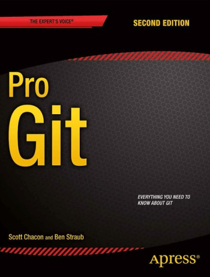
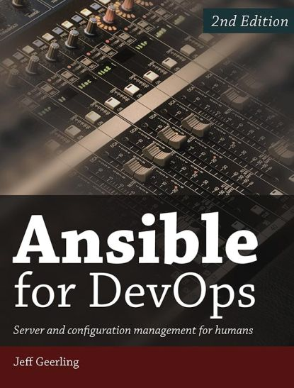

+++
title = "Books"
weight = 1
showDate = false
+++


Technical books I have read and found useful.


## Pro Git

<table>
    <tr>
        <td style="font-size: 13pt; padding: 0 20px 0 0; text-align: justify;">
            Version control is an essential part of software development, and <strong>Git</strong> is the de facto tool for it. <a href="https://git-scm.com/book/en/v2/" target="_blank">Pro Git</a> provides all the information needed to get started as a beginner, but it also covers advanced topics for experienced users.  
            I believe that even though 90% of the work can be done using fewer than 10 Git commands, having a more in-depth understanding of Git provides the confidence to use it effectively and troubleshoot unexpected situations.
        </td>
        <td style="width: 220px; vertical-align: top;">
            
        </td>
        </tr>
</table>

## Ansible for DevOps

<table>
    <tr>
        <td style="width: 220px; vertical-align: top;">
            
        </td>
        <td style="font-size: 13pt; padding: 0 0 0 20px; text-align: justify;">
            <strong>Ansible</strong> is a wonderful tool for automating almost everything server-related. <a href="https://www.ansiblefordevops.com/" target="_blank">Ansible for DevOps</a> guides the reader from running ad-hoc Ansible commands to writing playbooks and organizing solutions into roles.  
            The author, Jeff Geerling, is well known in the Ansible community, and he maintains several widely used Ansible roles on GitHub.  
            I believe that knowing the basics of Ansible can be very useful for anyone who enjoys automation.
        </td>
    </tr>
</table>

## Mastering Ubuntu Server

<table>
    <tr>
        <td style="font-size: 13pt; padding: 0 20px 0 0; text-align: justify;">
            <strong>Ubuntu</strong> is one of the most popular Linux distributions. It is well documented and has decades of guides and tutorials available online.  
            Nonetheless, it is beneficial to have a modern, structured, and comprehensive collection of information about how to get started with more advanced topics down the road. <a href="https://ubuntuserverbook.com/" target="_blank">Mastering Ubuntu Server</a> is that book.  
            This book helps the reader understand what to expect when working with Ubuntu.
        </td>
        <td style="width: 220px; vertical-align: top;">
            
        </td>
    </tr>
</table>
